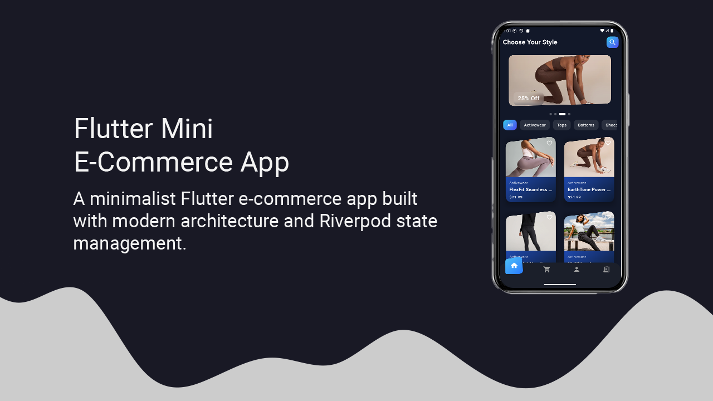

# flutter_mini_ecommerce



A clean, open-source **e-commerce app built with Flutter**, showcasing modern mobile architecture and Riverpod-based state management.

> ⚠️ **Note:** This project is currently under development. Expect frequent changes & improvements. Stay tuned for updates!

---

## ✨ Planned Features

| Status | Feature                        |
|--------|--------------------------------|
| ✅     | Project setup & structure      |
| ✅     | Product listing from Mock Product API |
| ✅     | Product detail view            |
| 🔄     | Cart management (add/remove)   |
| 🔲     | Checkout screen (mock)         |
| 🔲     | Local cart persistence (Hive)  |
| 🔲     | Responsive design              |
| 🔲     | Dark mode support              |
| 🔲     | Language localization (EN/TR)  |

---

## 🧱 Tech Stack

| Tool            | Description                        |
|-----------------|------------------------------------|
| 🧠 Flutter       | Mobile UI toolkit                  |
| ⚙️ Riverpod      | State management                  |
| 🔀 GoRouter      | Navigation & routing               |
| 🌐 Dio           | Networking                         |
| 💾 Hive/Prefs    | Local storage (planned)            |
| 🎨 Material 3    | Theming and styling                |

---

## 🔧 Getting Started

```bash
git clone https://github.com/yigit433/flutter_mini_ecommerce.git
cd flutter_mini_ecommerce
flutter pub get
flutter run
```

> Make sure Flutter is installed and properly configured. Run flutter doctor to verify.

📸 Screenshots 


## 💡 TODO / Roadmap

- [X] Initial project setup
- [X] Home UI & Product Card
- [X] Product Info Page
- [X] Creating data repository
- [ ] Cart logic & UI
- [ ] Checkout screen
- [ ] Local data saving
- [ ] Basic testing (unit + widget)

## 🤝 Contributing
Contributions are welcome! If you'd like to fix a bug, add a feature, or improve documentation, please fork the repo and open a PR.

## 📜 License
[MIT License](LICENSE)
Developed by [Yiğit](https://github.com/yigit433) with ❤️

## 📣 Stay Tuned!
Follow the repo, drop a ⭐️, and check back soon — the cart is loading! 🛒